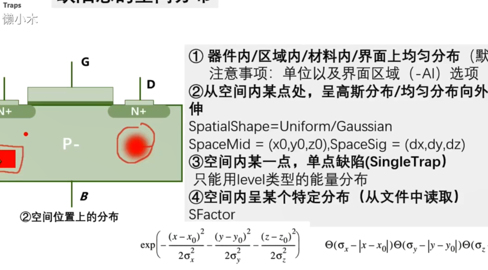

# 3-8：缺陷与辐照特性仿真（单粒子效应）

### 缺陷设置代码

```scheme{.line-numbers}


#   #if ![string match "-" "@traps@"]
   ##if ![string match "*interface*" "@traps@"]
	Traps(
   	   # level exponential Gaussian table(experiment)
   	   # bulk traps (cm^-3)
   	   #if [string match "*Acceptor*" "@traps@"]
		   # acceptor exponential tail of the conduction band 
		   (Acceptor Exponential Conc=1.5e19 EnergySig=0.05 EnergyMid=0 fromCondBand 
		   hXsection= 1e-14 eXsection=1e-15 )
		   # acceptor deep levels
		   (Acceptor Gaussian Conc=1.9e18 EnergySig=0.1 EnergyMid=0.08 fromMidBandGap )
   	   #endif 
   	   #if [string match "*Donor*" "@traps@"]
		   (Donor 	Exponential 	Conc=1e18		fromValBand 	EnergyMid=0 	EnergySig=0.05)
   	   	   (Donor 	Gaussian 		Conc=1.13e18	fromValBand  	EnergyMid=0.51 	EnergySig=0.1)
   	   #endif    	   
  
   )
   ##endif
   #endif

####### EnergySig 浓度衰减系数  EnergyMid=0.08 能量参考点（峰值浓度位置）  fromcondband以导带为参考位置
#######  带尾态影响IDVG曲线后半段，深能级影响IDVG曲线中间的亚阈值区
####### Gaussian 深能级                        exponential 带尾态
####### sde "-AI" （add interface region）
####### 固定电荷 conc大于零为正固定电荷，为负为负的固定电荷。其他缺陷中conc必须大于零。
```

### 重离子入射（单粒子烧毁）代码

```scheme{.line-numbers}
	HeavyIon(
		# angel 0-180 
		Direction = (@<cos(angle/180.0*3.1415926)>@,@<sin(angle/180.0*3.1415926)>@) # (vx vy) vector 
		Location = (@x0@,0) #(x0 y0)
		Time = 1.0e-10 #0.1ns
		Length = [0.1 0.2 0.3 0.4 ]      # unit ???	[PicCoulomb um] [None: cm]
		Wt_hi  = [0.05 0.1 0.2 0.1 ]# unit ??? [PicCoulomb um] [None: cm]
		LET_f =  [0.1 0.2 0.3 0.2 ] #unit [PicCoulomb pC/um] [None: Pairs/cm3]
		Gaussian # lateral distribution
		PicoCoulomb
	)
```

### 缺陷位置随机分布代码

```scheme{.line-numbers}
Physics(Material="Silicon"){
	* Drift-Diffuse Model
 
	Mobility (
	  DopingDep
	  Enormal
	  HighFieldSaturation
	)
	Recombination(
		SRH  
		Auger
	)
	EffectiveIntrinsicDensity(OldSlotboom)

   #if ![string match "-" "@model@"]
   ##if ![string match "*interface*" "@traps@"]
	Traps(
 	   #if [string match "*SpatialShape*"  "@model@"]
   	  	 (Acceptor Exponential Conc=1.5e19 EnergySig=0.05 EnergyMid=0 fromCondBand 
   	  	 	 #if [string match "*uniform*"  "@model@"]
   	  	 	 	SpatialShape=Uniform SpaceMid= (0.0 0.01 0.00) SpaceSig= (0.01 0.01 0.01)
   	  	 	 #endif 
   	  	 	 #if [string match "*gaussian*"  "@model@"]
   	  	 	 	SpatialShape=Gaussian SpaceMid= (0.0 0.01 0.00) SpaceSig= (0.01 0.01 0.01)
   	  	 	 #endif
   	  	 )
   	   #endif
   	   
   	   #if [string match "*Rand*" "@model@"]
   	   		#define _Rand_ Randomize  
   	   #else 
   	   		#define _Rand_ 
   	   #endif
   	   
   	   #if [string match "*SingleTrap*"  "@model@"]
   	   # only: level
   	   		(Acceptor SingleTrap Level Conc= 1e22 EnergyMid=0 fromMidBandgap SpaceMid=(0.0 0.005 0.00)
   	   			_Rand_
   	   		)	   
   	   #endif
   	   
   	   #if [string match "*DeepLevels*" "@model@"]
   	   		(Acceptor SFactor= "DeepLevels" Gaussian EnergyMid=0 EnergySig= 0.05 fromMidBandGap)
   	   #endif
   	   
   	   #if [string match "*SpatialLevel*" "@model@"]
   	   		(Acceptor Level Conc= 1e22 EnergyMid=0 fromMidBandgap 
   	   			SpatialShape=Gaussian SpaceMid= (0.0 0.01 0.00) SpaceSig= (0.01 0.01 0.01)
   	   			_Rand_
   	   		)
   	   #endif
   	   
   )
   ##endif
   #endif
}

```



date：20221017
